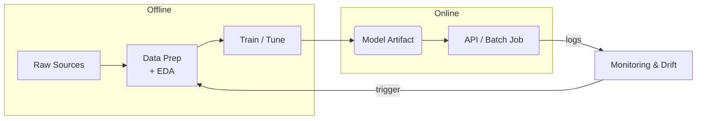

# 👾 MLDLC – End-to-End Machine-Learning Project Template

This repository is a **ready-made workflow skeleton** for any ML project, small
or large.  
It captures the full _Machine-Learning Development Life-Cycle_ (MLDLC) in
clearly separated phases—so every new problem you tackle starts with the same,
battle-tested structure instead of an empty folder.

## Why use this repo?

- **Consistent anatomy** – one place for data, code, reports, and models
- **Phase gates** – checklists ensure you don’t jump ahead with fuzzy scope
- **Security & governance hooks** – PII masking, lineage, and basic compliance
- **Extensible** – each phase ships with a runnable Python stub you can swap or extend; add new columns, new transforms, or new models in minutes.
- **Tool-agnostic** – works for tabular, NLP, vision, or time-series; local or cloud; nothing fancy like time‑series or images (yet you could extend it).

## Repo Scaffold

```text
.
├── data/
    # Immutable data snapshots (tracked by DVC or Git LFS)
│   ├── raw/
    # Phase‑2 ingestion outputs (never edit manually!)
│   ├── interim/
    # Phase‑3 “cleaned & imputed” datasets
│   └── processed/
    # Phase‑3 “scaled / transformed” datasets
├── docs/
    # Auto‑generated or hand‑maintained Markdown docs
│   ├── feature\_dictionary.md
    # (Auto‑generated in Phase‑5)
│   └── feature\_notes.yaml
    # (Optional manual notes to augment feature‐dict)
├── tests/
    # Unit tests for each phase
├── models/
    # Phase‑5 preprocessor + Phase‑6 model artifacts
│   ├── preprocessor.joblib
│   ├── preprocessor\_manifest.json
├── notebooks/                    # Optional ad‑hoc Jupyter notebooks
│
├── reports/
    # Auto‑generated reports (EDA, baseline, feature audits)
│   ├── eda/
    # Phase‑4 EDA outputs
│   ├── baseline/
    # Phase‑5½ baseline metrics
│   ├── feature/
    # Phase‑5 feature audit + shape
│   └── lineage/
    # Phase‑3 lineage manifests
│
├── src/
│   ├── Data Ingestion/
│   │   └── data_collector.py     # Phase-2 engine  (⇨ see link below)
│   ├── Data Cleaning/
│   │   ├── data_preparation.py   # Prep pipeline  (Phase-3)
│   │   └── data_wrangling_cleaning.py
│   ├── Data Analysis/
│   │   ├── EDA.py                # Basic EDA      (Phase-4)
│   │   └── EDA_advance.py        # Advanced EDA   (Phase-4 extra)
│   └── Feature Engineering/
│       └── feature_engineering.py
│   │
│   └── feature\_engineering/
│       ├── **init**.py
│       └── feature\_engineering.py
        # Phase‑5 “FeatureEngineer” buffet (scalers, encoders, bins, MI filter, custom plug‑ins)
├── docker/                       # Dockerfile & helpers
├── dvc.yaml                      # DVC pipeline (not modified here; see “How to run” below)
├── params.yaml                   # Parameter file (not modified here)
├── pyproject.toml                # Python metadata / dependencies
├── .gitignore
└── README.md                     # ← You are reading it
```

> **Note:** Make sure you create a Python virtual environment (e.g. `python -m venv .venv && source .venv/bin/activate`) and then install dependencies via:
>
> ```bash
> pip install -e .
> pip install -r requirements-dev.txt
> ```

---

## Table of Contents

0. [Repo Scaffold](#0-repo-scaffold)

1. [Phase 1 — Problem Definition](#1-phase-1--problem-definition)

2. [Phase 2 — **Data Collection**](src/Data%20Ingestion/data_collector.py)

   - [2A Flat-Files & Object Storage](src/Data%20Ingestion/Data%20Ingestion.md#2a-flat-files--object-storage)
   - [2B Relational Databases](src/Data%20Ingestion/Data%20Ingestion.md#2b-relational-databases)
   - [2C NoSQL & Analytical Stores](src/Data%20Ingestion/Data%20Ingestion.md#2c-nosql--analytical-stores)
   - [2D APIs & Web Scraping](src/Data%20Ingestion/Data%20Ingestion.md#2d-apis--web-scraping)
   - [2E Streaming & Message Queues](src/Data%20Ingestion/Data%20Ingestion.md#2e-streaming--message-queues)
   - [2F SaaS & Cloud-Native Connectors](src/Data%20Ingestion/Data%20Ingestion.md#2f-saas--cloud-native-connectors)
   - [2G Sensors & IoT](src/Data%20Ingestion/Data%20Ingestion.md#2g-sensors--iot)
   - [2H Data Privacy & Governance Hooks](src/Data%20Ingestion/Data%20Ingestion.md#2h-data-privacy--governance-hooks)
   - [2I Logging, Auditing & Checksums](src/Data%20Ingestion/Data%20Ingestion.md#2i-logging-auditing--checksums)

3. [Phase 3 — **Data Preparation**](src/Data%20Cleaning/data_preparation.py)

   - [3A Schema Validation & Data Types](src/Data%20Cleaning/Data%20Cleaning.md#3a-schema-validation--data-types)
   - [3B1 De-duplication and Invariant Pruning](src/Data%20Cleaning/Data%20Cleaning.md#3b-dedup)
   - [3B Missing-Value Strategy](src/Data%20Cleaning/Data%20Cleaning.md#3b-missing-value-strategy)
   - [3C Outlier Detection & Treatment](src/Data%20Cleaning/Data%20Cleaning.md#3c-outlier-detection--treatment)
   - [3D Data Transformation & Scaling](src/Data%20Cleaning/Data%20Cleaning.md#3d-data-transformation--scaling)
   - [3E Class / Target Balancing](src/Data%20Cleaning/Data%20Cleaning.md#3e-class-target-balancing)
   - [3F Data Versioning & Lineage](src/Data%20Cleaning/Data%20Cleaning.md#3f-data-versioning--lineage)
   - [3G Feature Pruning (High NaN / High Corr)](src/Data%20Cleaning/Data%20Cleaning.md#3g-prune)

4. [Phase 4 — **Exploratory Data Analysis (EDA)**](src/Data%20Analysis/EDA.py)
   - [4A Univariate Statistics & Plots](src/Data%20Analysis/Data%20Analysis.md#4a-univariate-statistics--plots)
   - [4B Bivariate Tests & Visuals](src/Data%20Analysis/Data%20Analysis.md#4b-bivariate-tests--visuals)
   - [4C Multivariate Tests & Diagnostics](src/Data%20Analysis/Data%20Analysis.md#4c-multivariate-tests--diagnostics)
   - [4D Advanced EDA (MI · Cramer-V · Embeddings · TS Decomp)](src/Data%20Analysis/EDA_advance.py)

4·½. [Feature Selection & Early Split](src/Data%20Analysis/Data%20Analysis.md#4.5-feature-selection--split)

5. [Phase 5 — Feature Engineering](src/Feature%20Engineering/feature_engineering.py)

   - [5A Scaling & Normalization](src/Feature%20Engineering/Feature%20Engineering.md#5-phase-5--feature-engineering)
   - [5B Encoding Categorical Variables](#5b-encoding-categorical-variables)
   - [5C Handling Imbalanced Data](#5c-handling-imbalanced-data)
   - [5D Dimensionality Reduction](#5d-dimensionality-reduction)
   - [5E Custom Feature-Engineering Plug-ins](src/Feature%20Engineering/Feature%20Engineering.md#5e-custom--advanced-plug-ins)

5.½. [Dataset Partition & Baseline Benchmarking](src/Feature%20Engineering/Feature%20Engineering.md#5.5-phase-baseline-freeze)

6. [Phase 6 — Model Design & Training](#6-phase-6--model-design--training)

   - [6A Algorithm Selection](#6a-algorithm-selection)
   - [6B Regularisation Techniques](#6b-regularisation-techniques)
   - [6C Cross-Validation Variants](#6c-cross-validation-variants)
   - [6D Hyper-Parameter Optimisation](#6d-hyper-parameter-optimisation)
   - [6E Early-Stopping & LR Scheduling](#6e-early-stopping--lr-scheduling)
   - [6F Ensembling & Bagging / Stacking](#6f-ensembling--bagging--stacking)
   - [6G Data Augmentation & Noise Injection](#6g-data-augmentation)

7. [Phase 7 — **Evaluation, Regularisation Audit & Hardening**](#7-phase-7--evaluation-regularisation--hardening)

   - [7A Core Metrics](#7a-core-metrics)
   - [7B Calibration & Probabilistic Quality](#7b-calibration--probability-quality)
   - [7C Bias / Fairness & Group Metrics](#7c-bias--fairness)
   - [7D Explainability (SHAP · LIME · XAI)](#7d-explainability)
   - [7E Robustness & Adversarial Testing](#7e-robustness--adversarial-testing)
   - [7F Over-fitting Diagnostics](#7f-over-fitting-diagnostics)
   - [7G Model Card & Governance Sign-off](#7g-model-card--governance)

8. [Phase 8 — **Deployment & Serving**](#8-phase-8--deployment--serving)

   - [8A Model Serialization](#8a-model-serialization)
   - [8B Packaging & Containerization](#8b-packaging--containerization)
   - [8C API & Micro-service Layer](#8c-api--micro-service-layer)
   - [8D Inference Optimisation](#8d-inference-optimisation)
   - [8E CI/CD & Model-Registry Promotion](#8e-cicd--model-registry-promotion)
   - [8F Release Strategies](#8f-release-strategies)
   - [8G Runtime Security](#8g-runtime-security)

9. [Phase 9 — **Monitoring, Drift & Retraining**](#9-phase-9--monitoring-drift--retraining)

   - [9A Performance & Latency Metrics](#9a-performance--latency-metrics)
   - [9B Data & Concept Drift Detection](#9b-data--concept-drift-detection)
   - [9C Model Quality Tracking & Alerts](#9c-model-quality-tracking--alerts)
   - [9D Logging & Audit Trails](#9d-logging--audit-trails)
   - [9E Automated Retraining Pipelines](#9e-automated-retraining-pipelines)
   - [9F Rollback / Roll-forward Playbooks](#9f-rollback--roll-forward-playbooks)
   - [9G Continuous Compliance & Model Registry](#9g-continuous-compliance--model-registry)

10. [Cloud-Security Pillars](#10-cloud-security-pillars)

11. [CI/CD & Automation](#11-cicd--automation)

12. [FAQ](#12-faq)

---

## 1 — Phase 1 · Problem Definition<a name="1-phase-1--problem-definition"></a>

> **Goal** — crystallise a fuzzy idea into an _implementable, testable and
> measurable_ ML plan.
> This phase is finished only when every item in the **Exit Checklist** is
> tick-boxed and signed off.

---

### 1 · Clarify the Business “Why”

| Ask                                                     | Why it matters                                         |
| ------------------------------------------------------- | ------------------------------------------------------ |
| _“If the model is perfect tomorrow, what changes?”_     | forces ROI thinking, surfaces hidden KPIs              |
| _“Who loses sleep if this fails?”_                      | reveals actual decision-makers / veto-holders          |
| _“What is the cost of a wrong prediction?”_             | calibrates class-imbalance weighting, thresholds, SLAs |
| **“What is the current manual / heuristic benchmark?”** | Defines the _baseline to beat_                         |

---

### 1.2 · Translate to an ML Task

1. **Prediction vs. ranking vs. clustering?**
   Map to _supervised_, _recommender_, _unsupervised_ or _forecasting_ bucket.
2. **Unit of prediction** (row-level? session? account? pixel?).
   Mis-scoping here kills performance later.
3. **Latency tolerance** → batch, near-real-time, or streaming.
4. **Interpretability & constraints** &nbsp;—&nbsp; e.g. model must be explainable
5. **Regulatory context** &nbsp;—&nbsp; GDPR, HIPAA, sector-specific rules

> _Tip_: if you can’t phrase the target as a column in a future CSV,
> you don’t have a learnable task yet.

---

### 1.3 · Do a Data Reality Check _before_ Deep EDA

- Column availability at **prediction time** (no future leakage).
- Gauge **volume vs freshness vs drift risk**.
- Quick uni-variate histograms → smell test for PII, bogus zeros, unit errors.
- Compare simple **baselines** (constant, majority-class, heuristic) to KPI.
  If a baseline already beats the target KPI, challenge the need for ML.

---

### 1.4 · Scope & Deliverables (one-pager)

| Section          | Example entry (fill in)                                      |
| ---------------- | ------------------------------------------------------------ |
| **In-scope**     | Web-app customers, last 2 years of activity logs             |
| **Out-of-scope** | Mobile-app only users, customer-support notes                |
| **Deliverables** | ① Trained model artifact<br>② Inference API spec<br>③ README |
| **Timeline**     | 12 weeks (M1-M3), pilot rollout in Q4                        |

---

### 1.5 · SMART Success Criteria & Metrics

| Category         | Target metric & threshold | Why this metric?                             |
| ---------------- | ------------------------- | -------------------------------------------- |
| **Primary**      | ROC-AUC ≥ 0.85            | Class-imbalance; need good ranking power     |
| **Secondary**    | F1 ≥ 0.75                 | Balance precision & recall for interventions |
| **Business KPI** | ↓ churn rate by 15 %      | Direct financial impact                      |

> **Justify the metric**: ROC-AUC is threshold-independent and robust for
> imbalanced data; F1 captures the harmonic mean of precision & recall which
> suits the “find true churners” objective.

---

### 1.6 · Baseline Expectation

> Current heuristic = _always predict “no churn”_
> → Accuracy ≈ 75 %, F1 ≈ 0.00, ROC-AUC ≈ 0.50
> Our ML model **must beat this baseline** on the hold-out set to be worthwhile.

---

### 1.7 · Sketch the End-to-End Flow on One Whiteboard



---

### 1.8 Problem-Clarity ✅ **Exit Checklist**

_(all boxes must be ticked before Phase 2 – Data Collection – may start)_

- [ ] **Business objective** phrased as one SMART sentence
      _e.g._ “Reduce voluntary churn by 15 % within 2 quarters”
- [ ] **Unit of analysis** defined – “prediction per _customer-ID_ per month”
- [ ] **Target variable** unambiguously stated and time-stamped
      (`is_churn` ∈ {0, 1} measured 30 days after billing date)
- [ ] **Primary success metric** & numeric threshold agreed – “F1 ≥ 0.82 on Q4 hold-out”
- [ ] **Baseline approach** written down (random or simple heuristic score)
- [ ] **All items reviewed & signed off** (attach link in project tracker)

> When the table is fully checked, create an issue titled
> **“Phase-1 Complete – proceed to Data Collection”** and assign it to the team lead.
> Only then move on to Phase-2.

---

## Getting Started

### 1. Clone & bootstrap

```bash
git clone <this-repo> ; cd mldlc
python -m venv .venv && source .venv/bin/activate   # or conda/mamba
pip install -e .[dev]                               # brings deps + extras
dvc pull                                            # pulls example data (if remote set)
```

### 2. Reproduce the entire pipeline

```bash
dvc repro                                           # runs every stage once
```

> Need only a subset? Append the stage name – e.g. `dvc repro prepare`
> (`dvc stage list` shows them all).

### 3. Tweak parameters & iterate

```bash
vim params.yaml                                     # change any flag
dvc exp run                                         # launches a new experiment
dvc exp diff                                        # shows metric deltas
dvc exp push -r origin                              # share results with the team
```

### 4. One-shot phase runs (skip DVC)

```bash
# Phase-2 : collect data
omni-collect file data/raw/users.csv --redact-pii --save

# Phase-3 : prepare with custom flags
python -m Data_Cleaning.data_preparation --knn --outlier iso --scaler robust

# Phase-4 : full EDA profile
python -m Data_Analysis.EDA --mode all --target is_churn --profile
```

### 5. Cleaning up work files

```bash
dvc gc -w               # remove unused data/artefacts in current workspace
rm -rf .venv            # nuke the virtual-env if you need a fresh start
```

---

```

```
