## 5 — Phase 5 · **Feature Engineering**<a name="5-phase-5--feature-engineering"></a>

> **Goal**: Create, transform, and augment features to improve model performance. All transforms run only on **train** (and val if needed), then applied to **test** to ensure no leakage.
> All “column-crafting” lives in **[`feature_engineering.py`](src/Feature%20Engineering/feature_engineering.py)**.  
> The `FeatureEngineer` class is a **buffet**: every classic transform is baked-in but
> disabled by default—switch items on via kwargs or a small JSON/YAML config.

---

### 5·A Menu of Built-in Options<a name="5-phase-5--feature-engineering"></a>

| Category                      | Turn on with ⇢                                                                | Notes                           |
| ----------------------------- | ----------------------------------------------------------------------------- | ------------------------------- | ------------------------------- | ------ | ------ | -------- | ------ | ------------------------- |
| **Numeric scalers**           | `numeric_scaler="standard                                                     | minmax                          | robust                          | maxabs | normal | quantile | none"` |                           |
| **Power / log**               | `numeric_power="yeo                                                           | boxcox                          | quantile"`·`log_cols=["price"]` |        |
| **Binning**                   | `quantile_bins={"age":4}` or `binning={"age":{"bins":5,"strategy":"kmeans"}}` |                                 |
| **Polynomial & interactions** | `polynomial_degree=2` · `interactions=True`                                   |                                 |
| **Rare grouping**             | `rare_threshold=0.01 # 1 %`                                                   | merges into `__rare__`          |
| **Cat encoders**              | `cat_encoder="onehot                                                          | ordinal                         | target                          | woe    | hash   | freq     | none"` | Target/WOE need `target=` |
| **Text vecs**                 | `text_vectorizer="tfidf                                                       | count                           | hashing"`·`text_cols=[…]`       |        |
| **Datetime expand**           | `datetime_cols=[…]`                                                           | Y/M/D/DOW/HR                    |
| **Cyclical sin–cos**          | `cyclical_cols={"month":12,"dow":7}`                                          |                                 |
| **Date deltas**               | `date_delta_cols={"signup":"today"}`                                          | days-since                      |
| **Aggregations**              | `aggregations={"cust_id":["amt_mean","amt_sum"]}`                             | group-by roll-ups               |
| **SMOTE**                     | `sampler="smote"`                                                             | oversample during **fit**       |
| Custom plug-ins               | `custom_steps=[my_func]`                                                      | any `pd.DataFrame→pd.DataFrame` |

---

### 5·B Quick Recipes

**Minimal**

```python
fe = FeatureEngineer(target="is_fraud").fit(df)
X  = fe.transform(df)
fe.save()  # ➜ models/preprocessor.joblib
```

**Heavy stack**

```text
src/feature_engineering/feature_engineering.py
    FeatureEngineer(
        target="is_churn",
        numeric_scaler="robust",           # standard|minmax|robust|none
        numeric_power="yeo",               # yeo|boxcox|quantile|none
        log_cols=["revenue"],              # apply `log1p` to these columns
        quantile_bins={"age":4},           # 4 quantile bins for age
        polynomial_degree=2,               # generate second‑order polynomials/interactions
        rare_threshold=0.01,               # group categories with <1 % frequency into “__rare__”
        cat_encoding="target",             # onehot|ordinal|target|woe|hash|freq|none
        text_vectorizer="tfidf",           # tfidf|count|hashing|none
        text_cols=["review"],              # columns to vectorize with text_vectorizer
        datetime_cols=["last_login"],       # for datetime expand (year/month/day/dow/hour)
        cyclical_cols={"hour":24},          # for hour→two sin/cos columns
        date_delta_cols={"signup_date":"2020-01-01"},  # days since signup
        aggregations={"customer_id":["amt_mean","amt_sum"]},  # groupby features: mean and sum
        drop_nzv=True,                     # Phase 4½ near‑zero variance prune (fast)
        corr_threshold=0.95,               # Phase 4½ high‑corr prune for numeric
        mi_quantile=0.10,                  # Phase 4½ drop bottom 10 % MI/F‑score
        custom_steps=[my_custom_func],     # arbitrary pd.DataFrame→pd.DataFrame transforms
        save_path="models/preprocessor.joblib",
        report_dir="reports/feature"       # where to write feature_audit.json + shape
    )
```

```python
fe = FeatureEngineer(
        target="is_churn",
        numeric_scaler="robust",
        numeric_power="yeo",
        log_cols=["revenue"],
        quantile_bins={"age":4},
        cat_encoder="hash",
        rare_threshold=10,
        text_vectorizer="tfidf",
        text_cols=["review"],
        datetime_cols=["last_login"],
        cyclical_cols={"hour":24},
        polynomial_degree=2,
        sampler="smote"
        cat_encoding="target",
        text_vectorizer="tfidf",
        corr_threshold=.9,
        mi_quantile=.05
     ).fit(df, df.is_churn)
X = fe.transform(df); fe.save()
```

**CLI**

```bash
python -m Feature_Engineering.feature_engineering \
       --data data/processed/scaled.parquet \
       --target is_churn \
       --numeric_scaler robust \
       --log_cols revenue
```

---

### 5·C Artefacts <a name="5c-artifact--generated"></a>

| File                                   | Role                                       |
| -------------------------------------- | ------------------------------------------ |
| `models/preprocessor.joblib`           | Frozen transform pipeline (+SMOTE if used) |
| `models/preprocessor_manifest.json`    | SHA-256 + config snapshot                  |
| `reports/feature_shape.txt`            | Dense/-sparse shape & nnz %                |
| `reports/feature/feature_audit.json`   | n features before / after filtering        |
| `docs/feature_dictionary.md`           | human-readable feature dictionary          |
| `docs/feature_notes.yaml` _(optional)_ | hand-written blurbs                        |

---

### 5·D Custom Feature-Engineering Plug-ins<a name="5d-custom--advanced-plug-ins"></a>

Not every transform you need will fit the built-ins.
`FeatureEngineer` therefore accepts a list of **arbitrary callables**:

```python
custom_steps = [my_func1, my_func2, …]   # each:  pd.DataFrame → pd.DataFrame
```

They run **after** the standard ColumnTransformer, so they can read/write any
columns already produced by scaling, encoders, text vectors, etc.

#### Example – domain ratios & log-tenure

```python
import numpy as np, pandas as pd
from Feature_Engineering.feature_engineering import FeatureEngineer

def add_ratios(df: pd.DataFrame) -> pd.DataFrame:
    df = df.copy()
    df["spend_per_visit"] = df["total_spend"] / (df["num_visits"].clip(lower=1))
    df["log_tenure"]      = np.log1p(df["tenure_days"])
    return df

fe = FeatureEngineer(
        target="is_churn",
        numeric_scaler="standard",
        custom_steps=[add_ratios]
     ).fit(train_df, train_df.is_churn)

X_train = fe.transform(train_df)
fe.save()   # new columns now frozen into pre-processor
```

_Guidelines_

- Return **all original columns + new ones** (don’t drop unless intentional).
- Keep it **pure**: no I/O, no global state—makes the pipeline portable.
- If you need parameters, wrap them in a closure or `functools.partial`.
- Add unit-tests in `tests/test_custom_steps.py` so the Phase-5 exit checklist
  can verify they still work after refactors.

> Once your custom step is serialised inside `preprocessor.joblib`, every model
> in Phase 6 will use it automatically—no extra code paths to maintain.

### 5·E Automated **Feature Dictionary & Audit**<a name="5f-feature-dictionary"></a>

| ❓ **Why bother?** | • New joiners instantly know what every column means.<br>• Reviewers & auditors can trace transformations and PII removal.<br>• CI can diff dictionaries and alert you when features silently disappear. |

> **Output** – a single Markdown file<br> > **`docs/feature_dictionary.md`** regenerated on every Phase-5 run.

---

#### 🔨 How it is built & where it lives

1. **`feature_engineering.py`** writes a machine-readable summary
   to **`reports/feature/feature_audit.json`** each time you call `.save()`.
   It records:

   - origin column
   - transformation(s) applied
   - final dtype & whether it survived NZV / MI / filter rules

2. _(Optional)_ Curate human-friendly notes in
   **`docs/feature_notes.yaml`** (one-liners, units, caveats).

3. **`scripts/build_feature_dict.py`** merges the JSON + YAML and spits out
   the Markdown table.

   ```bash
   python scripts/build_feature_dict.py
   ```

The helper is invoked automatically at the end of the **Phase-5 CLI**
(`python -m Feature_Engineering.feature_engineering …`), but you can run it
stand-alone if you edit notes.

4. CI / Git pre-commit can diff the generated file to catch sneaky feature
   drifts.

---

#### ✨ Sample snippet from the generated dictionary

```markdown
# 📖 Feature Dictionary (63 columns)

| Feature          | Origin   | Transform      | Kept | Notes                                           |
| ---------------- | -------- | -------------- | ---- | ----------------------------------------------- |
| `income_log`     | income   | log1p          | ✅   | Log of monthly income to mitigate right-skew.   |
| `cyc_month_sin`  | month    | cyclical (sin) | ✅   | Sine component of calendar month (period = 12). |
| `zip_target_enc` | zip_code | target encode  | ✅   | Smoothed target-encoding of 18 k ZIP codes.     |
| `cust_id`        | cust_id  | —              | ❌   | Dropped – identifier only.                      |
```

---

### 5.F Exit-check add-on (tick before Phase 6)

- [ ] `feature_dictionary.md` updated & committed
- [ ] Any newly _dropped_ or _added_ columns reviewed by a teammate
- [ ] Hand-written notes added for every new engineered feature
- [ ] Pipeline was fitted on **train + val** only (no test leakage).
- [ ] `preprocessor.joblib` is tracked by DVC or your model registry.
- [ ] `feature_shape.txt` logged (shape: `n_samples × n_features_after_transform`).
- [ ] No silent column drops (all cat/text columns either encoded or passed through).
- [ ] All custom plug‑in tests pass (`tests/test_custom_steps.py`).

---

#### 5.G Custom Feature‑Engineering Plug‑Ins

Any transform that doesn’t fit the built‑ins can be added as a `custom_steps=[func1, func2, …]`. Each `func` must be:

```python
def my_custom_func(df: pd.DataFrame) -> pd.DataFrame:
    # - MUST return all original columns + any NEW columns you want to add.
    # - NO I/O or global state inside the function. (Make it “pure.”)
    # - If you need parameters, wrap them in a closure or use functools.partial.
    # Example: add domain‑specific ratio features + log tenure:
    out = df.copy()
    out["spend_per_visit"] = out["total_spend"] / (out["num_visits"].clip(lower=1))
    out["log_tenure"]      = np.log1p(out["tenure_days"])
    return out
```

After the pipeline serializes your function in `models/preprocessor.joblib`, every model in Phase 6 automatically uses it—no extra code paths.

---

## 🆕 Phase 5·½ — **Baseline Benchmarking & & Pre-Processor Freeze** <a name="5.5-phase-baseline-freeze"></a>

> **Goal**: _Glue_ between **Feature Engineering** and **Model Design**.
> Freezes deterministic splits, prevents leakage, and sets a “beat-that” baseline.

| Sub-step                          | Goal                                                        | Artefact(s)                                                    |
| --------------------------------- | ----------------------------------------------------------- | -------------------------------------------------------------- |
| **5·0 Train / Val / Test Split**  | Comparable, leak-free folds                                 | `data/splits/{train,val,test}.parquet` + `split_manifest.json` |
| **5·1 Stratification / Grouping** | Preserve class proportions or entity boundaries             | implemented inside **`split_and_baseline.py`**                 |
| **5·2 Baseline Model(s)**         | Majority-class, mean regressor, or random ranker            | `reports/baseline/baseline_metrics.json`                       |
| **5·3 Sanity Checks**             | Duplicate-row catch, leakage sniff, feature-drift check     | pipeline aborts on failure                                     |
| **5·4 Data-Pipeline Freeze**      | Persist the _fitted_ pre-processor used to build the splits | `models/preprocessor.joblib` + `preprocessor_manifest.json`    |

#### 📜 Code location

`src/Data Cleaning/split_and_baseline.py` – single class **`SplitAndBaseline`**
(`fit → split → baseline → checks → freeze`).

```bash
# run end-to-end
python -m Data_Cleaning.split_and_baseline \
       --target is_churn \
       --stratify \
       --seed 42

```



```mermaid
flowchart TD
    A[0 · LOAD<br>processed.parquet] --> B[1 · STRAT / SPLIT]
    B --> C[2 · BASELINE<br>majority / mean]
    C --> D[3 · SANITY CHECKS]
    D --> E[4 · FREEZE PREPROCESSOR<br>+ SHA manifest]
```

The script:

1. Loads **`data/processed/scaled.parquet`**
2. Creates deterministic splits (stratified if flagged)
3. Computes & stores baseline metrics
4. Runs fast-fail leakage / duplication checks
5. Saves a SHA-stamped `preprocessor.joblib` + manifest

> **Exit criterion:** anyone can clone the repo, run `make baseline`,
> and reproduce the metrics within **± 0.01**.
> If the script fails, fix the issues before proceeding to Phase 6.

---

```

```
