## 5 — Phase 5 · **Feature Engineering**<a name="5-phase-5--feature-engineering"></a>

> All “column-crafting” lives in **[`feature_engineering.py`](src/Feature%20Engineering/feature_engineering.py)**.  
> The `FeatureEngineer` class is a **buffet**: every classic transform is baked-in but
> disabled by default—switch items on via kwargs or a small JSON/YAML config.

---

### 5·A Menu of Built-in Options<a name="5-phase-5--feature-engineering"></a>

| Category                  | Turn on with ⇢                                                                | Notes                           |
| ------------------------- | ----------------------------------------------------------------------------- | ------------------------------- | ------------------------------- | ------ | ------ | -------- | ------ | ------------------------- |
| Numeric scalers           | `numeric_scaler="standard                                                     | minmax                          | robust                          | maxabs | normal | quantile | none"` |                           |
| Power / log               | `numeric_power="yeo                                                           | boxcox                          | quantile"`·`log_cols=["price"]` |        |
| Binning                   | `quantile_bins={"age":4}` or `binning={"age":{"bins":5,"strategy":"kmeans"}}` |                                 |
| Polynomial & interactions | `polynomial_degree=2` · `interactions=True`                                   |                                 |
| Rare grouping             | `rare_threshold=0.01 # 1 %`                                                   | merges into `__rare__`          |
| Cat encoders              | `cat_encoder="onehot                                                          | ordinal                         | target                          | woe    | hash   | freq     | none"` | Target/WOE need `target=` |
| Text vecs                 | `text_vectorizer="tfidf                                                       | count                           | hashing"`·`text_cols=[…]`       |        |
| Datetime expand           | `datetime_cols=[…]`                                                           | Y/M/D/DOW/HR                    |
| Cyclical sin–cos          | `cyclical_cols={"month":12,"dow":7}`                                          |                                 |
| Date deltas               | `date_delta_cols={"signup":"today"}`                                          | days-since                      |
| Aggregations              | `aggregations={"cust_id":["amt_mean","amt_sum"]}`                             | group-by roll-ups               |
| SMOTE                     | `sampler="smote"`                                                             | oversample during **fit**       |
| Custom plug-ins           | `custom_steps=[my_func]`                                                      | any `pd.DataFrame→pd.DataFrame` |

---

### 5·B Quick Recipes

**Minimal**

```python
fe = FeatureEngineer(target="is_fraud").fit(df)
X  = fe.transform(df)
fe.save()  # ➜ models/preprocessor.joblib
```

**Heavy stack**

```python
fe = FeatureEngineer(
        target="is_churn",
        numeric_scaler="robust",
        numeric_power="yeo",
        log_cols=["revenue"],
        quantile_bins={"age":4},
        cat_encoder="hash",
        rare_threshold=10,
        text_vectorizer="tfidf",
        text_cols=["review"],
        datetime_cols=["last_login"],
        cyclical_cols={"hour":24},
        polynomial_degree=2,
        sampler="smote"
     ).fit(df, df.is_churn)
X = fe.transform(df); fe.save()
```

**CLI**

```bash
python -m Feature_Engineering.feature_engineering \
       --data data/processed/scaled.parquet \
       --target is_churn \
       --numeric_scaler robust \
       --log_cols revenue
```

---

### 5·C Artefacts

| File                                | Role                                       |
| ----------------------------------- | ------------------------------------------ |
| `models/preprocessor.joblib`        | Frozen transform pipeline (+SMOTE if used) |
| `models/preprocessor_manifest.json` | SHA-256 + config snapshot                  |
| `reports/feature_shape.txt`         | Dense/-sparse shape & nnz %                |

---

### 5·D Exit Checklist

- [ ] Pipeline fitted on **train + val** only (no test leakage)
- [ ] `preprocessor.joblib` tracked in DVC / registry
- [ ] Shape & sparsity logged
- [ ] No silent drops of cat/text columns
- [ ] Custom plug-in tests pass

---

### 5·E Custom Feature-Engineering Plug-ins<a name="5e-custom--advanced-plug-ins"></a>

Not every transform you need will fit the built-ins.
`FeatureEngineer` therefore accepts a list of **arbitrary callables**:

```python
custom_steps = [my_func1, my_func2, …]   # each:  pd.DataFrame → pd.DataFrame
```

They run **after** the standard ColumnTransformer, so they can read/write any
columns already produced by scaling, encoders, text vectors, etc.

#### Example – domain ratios & log-tenure

```python
import numpy as np, pandas as pd
from Feature_Engineering.feature_engineering import FeatureEngineer

def add_ratios(df: pd.DataFrame) -> pd.DataFrame:
    df = df.copy()
    df["spend_per_visit"] = df["total_spend"] / (df["num_visits"].clip(lower=1))
    df["log_tenure"]      = np.log1p(df["tenure_days"])
    return df

fe = FeatureEngineer(
        target="is_churn",
        numeric_scaler="standard",
        custom_steps=[add_ratios]
     ).fit(train_df, train_df.is_churn)

X_train = fe.transform(train_df)
fe.save()   # new columns now frozen into pre-processor
```

_Guidelines_

- Return **all original columns + new ones** (don’t drop unless intentional).
- Keep it **pure**: no I/O, no global state—makes the pipeline portable.
- If you need parameters, wrap them in a closure or `functools.partial`.
- Add unit-tests in `tests/test_custom_steps.py` so the Phase-5 exit checklist
  can verify they still work after refactors.

> Once your custom step is serialised inside `preprocessor.joblib`, every model
> in Phase 6 will use it automatically—no extra code paths to maintain.

## 🆕 Phase 5·½ — **Baseline Benchmarking & & Pre-Processor Freeze** <a name="5.5-phase-baseline-freeze"></a>

> _Glue_ between **Feature Engineering** and **Model Design**.  
> Freezes deterministic splits, prevents leakage, and sets a “beat-that” baseline.

| Sub-step                          | Goal                                                        | Artefact(s)                                                    |
| --------------------------------- | ----------------------------------------------------------- | -------------------------------------------------------------- |
| **5·0 Train / Val / Test Split**  | Comparable, leak-free folds                                 | `data/splits/{train,val,test}.parquet` + `split_manifest.json` |
| **5·1 Stratification / Grouping** | Preserve class proportions or entity boundaries             | implemented inside **`split_and_baseline.py`**                 |
| **5·2 Baseline Model(s)**         | Majority-class, mean regressor, or random ranker            | `reports/baseline/baseline_metrics.json`                       |
| **5·3 Sanity Checks**             | Duplicate-row catch, leakage sniff, feature-drift check     | pipeline aborts on failure                                     |
| **5·4 Data-Pipeline Freeze**      | Persist the _fitted_ pre-processor used to build the splits | `models/preprocessor.joblib` + `preprocessor_manifest.json`    |

#### 📜 Code location

`src/Data Cleaning/split_and_baseline.py` – single class **`SplitAndBaseline`**
(`fit → split → baseline → checks → freeze`).

```bash
# run end-to-end
python -m Data_Cleaning.split_and_baseline \
       --target is_churn \
       --stratify \
       --seed 42

```



```mermaid
flowchart TD
    A[0 · LOAD<br>processed.parquet] --> B[1 · STRAT / SPLIT]
    B --> C[2 · BASELINE<br>majority / mean]
    C --> D[3 · SANITY CHECKS]
    D --> E[4 · FREEZE PREPROCESSOR<br>+ SHA manifest]
```

The script:

1. Loads **`data/processed/scaled.parquet`**
2. Creates deterministic splits (stratified if flagged)
3. Computes & stores baseline metrics
4. Runs fast-fail leakage / duplication checks
5. Saves a SHA-stamped `preprocessor.joblib` + manifest

> **Exit criterion:** anyone can clone the repo, run `make baseline`,
> and reproduce the metrics within **± 0.01**.
> If the script fails, fix the issues before proceeding to Phase 6.

---
