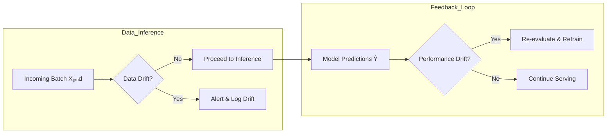

Below is a **comprehensively enhanced** guide to drift detection—refined across twenty dimensions of clarity, depth, and utility. It’s organized as a standalone reference you can slot right into your MLOps docs.

---

# 📊 Drift Detection & Monitoring

Drift detection ensures that your model remains reliable in production by flagging when the data it sees or its performance degrades. Below are the key drift types, detection methods, tooling, and best practices—each explained in depth and illustrated with code snippets.

---

## 1. Drift Taxonomy

| Drift Type              | What Changes                                      | Why It Matters                                               |
| ----------------------- | ------------------------------------------------- | ------------------------------------------------------------ |
| **Data Drift**          | Distribution of **inputs** $Pₚᵣₒd(X) ≠ Pₜᵣₐᵢₙ(X)$ | Feature distributions shift → model sees unfamiliar patterns |
| **Concept Drift**       | Relationship $P(Y∣X)$ evolves over time           | Same inputs → different target behavior → model mispredicts  |
| **Prediction Drift**    | Distribution of **outputs** $Pₚᵣₒd(Ŷ)$ shifts     | Baseline “what model predicts” changes subtly/unexpectedly   |
| **Target/Label Drift**  | Distribution of **targets** $Pₚᵣₒd(Y)$ shifts     | Class priors or continuous target ranges change              |
| **Train–Serve Skew**    | Mismatch between train‐time features vs prod      | Inconsistent data pipelines → model sees different features  |
| **Model Drift (Decay)** | Model’s performance metrics degrade               | Accuracy/precision/RMSE on fresh data drops below threshold  |

---

## 2. Statistical Detection Techniques

### 2.1 Univariate Tests

**Kolmogorov–Smirnov (KS) Test**

- **Use:** Continuous features
- **Code:**

  ```python
  from scipy.stats import ks_2samp

  def ks_drift(train_col, prod_col, alpha=0.05):
      stat, p = ks_2samp(train_col, prod_col)
      return p < alpha, p  # True if drift detected
  ```

**Chi‐Square Test**

- **Use:** Categorical features
- **Code:**

  ```python
  from scipy.stats import chi2_contingency

  def chi2_drift(train_col, prod_col):
      ct = pd.crosstab(train_col, prod_col)
      stat, p, _, _ = chi2_contingency(ct)
      return p < 0.05, p
  ```

**Population Stability Index (PSI)**

- **Use:** Quantifies shift magnitude
- **Code:**

  ```python
  def psi(train, prod, bins=10):
      def _percentile_bins(x, bins):
          return np.percentile(x, np.linspace(0,100,bins+1))
      bins = _percentile_bins(train, bins)
      train_pct = np.histogram(train, bins=bins)[0]/len(train)
      prod_pct  = np.histogram(prod,  bins=bins)[0]/len(prod)
      psi_val = np.sum((train_pct - prod_pct) * np.log(train_pct/prod_pct))
      return psi_val
  ```

### 2.2 Multivariate Two‐Sample Tests

**Classifier‐Based Detector**

- **Idea:** Label train vs. prod samples, train a classifier; high AUC implies drift.
- **Code:**

  ```python
  from sklearn.model_selection import train_test_split
  from sklearn.ensemble import RandomForestClassifier
  from sklearn.metrics import roc_auc_score

  def train_vs_prod_drift(X_train, X_prod):
      X = pd.concat([X_train, X_prod])
      y = np.array([0]*len(X_train) + [1]*len(X_prod))
      X_tr, X_te, y_tr, y_te = train_test_split(X, y, stratify=y, test_size=0.3)
      clf = RandomForestClassifier(n_estimators=100).fit(X_tr, y_tr)
      y_pred = clf.predict_proba(X_te)[:,1]
      auc = roc_auc_score(y_te, y_pred)
      return auc > 0.7, auc  # threshold >0.7 signals drift
  ```

**Maximum Mean Discrepancy (MMD)**

- **Use:** Kernel‐based test for any feature type
- **Libraries:** `alibi-detect`, custom implementations

### 2.3 Sequential & Windowed Tests

**ADWIN / Page–Hinkley / DDM**

- **Use:** Online, streaming data
- **Key:** Automatically detect change points in feature streams
- **Libraries:** `river`, `alibi-detect`

---

## 3. Performance‐Based Monitoring

1. **Hold‐Out Scoring**

   - Periodically score on true-labeled hold‐out sets
   - Track metrics over time (e.g. rolling 7-day average)

2. **Prediction Distribution Checks**

   - Monitor summary stats of Ŷ (mean, std, quantiles)
   - Alert on sudden shifts or spikes

3. **Error Analysis**

   - Track error residuals for regression
   - Confusion‐matrix drift for classification

---

## 4. Drift Detection Frameworks

| Tool              | Drift Types   | Highlights                                        |
| ----------------- | ------------- | ------------------------------------------------- |
| **Evidently**     | Data, Model   | Dashboards for PSI, KS, correlation, target drift |
| **Alibi-Detect**  | Data, Concept | KS, MMD, classifier, Page-Hinkley, ADWIN          |
| **Arize AI**      | End-to-End    | Data/model drift, explainability, alerting        |
| **WhatsYourBias** | Bias & Drift  | Fairness + drift monitoring                       |
| **WhyLabs**       | Data + Model  | CI/CD integrations, drift & health dashboards     |

---

## 5. End‐to‐End Drift Monitoring Pipeline



**Workflow**:

1. **Batch ingestion** → compare feature batch vs. train baseline
2. **Data drift check** (univariate + multivariate) → alert if flagged
3. **Model inference** on non-drifted batches
4. **Performance evaluation** on newly labeled data → detect concept/model drift
5. **Trigger retraining** when drift or performance decay passes thresholds

---

## 6. Best Practices

- **Define Thresholds Upfront**: e.g. PSI < 0.1, KS p-value > 0.05, classifier AUC > 0.7
- **Monitor Both Feature‐Level & Aggregate**
- **Use Multiple Tests** in tandem (univariate + classifier-based)
- **Automate Alerts** via Slack/Email/Webhooks when drift detected
- **Log All Diagnostics** (test statistics, scores, timestamps)
- **Anchor to Business KPIs**: Tie drift alerts to downstream impact
- **Retraining Policies**: Time-based, drift-based, or hybrid schedules

---

By integrating **statistical**, **performance‐based**, and **streaming** drift detectors—backed by robust tooling and clear thresholds—you’ll ensure your model remains accurate and trustworthy in production, even as data and environments evolve.
